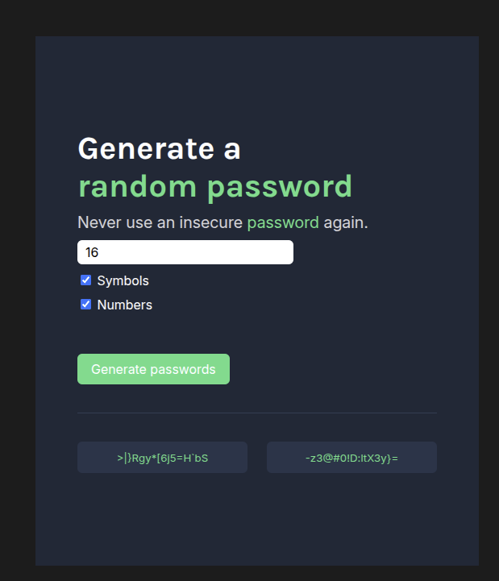

# 🔐 Password Generator

A fast and efficient random password generator designed to create secure passwords according to the user's needs.

🔗 **[View Live Preview Here](https://angelh200-password-generator.netlify.app/)**

## ✨ Features

* **Customizable length:** Allows the user to define the exact number of characters needed.
* **Character filters:** Integrated options (checkboxes) to include or exclude numbers and/or special symbols.
* **Double generation:** Generates 2 password options simultaneously to provide alternatives to the user.
* **Copy to clipboard:** One-click functionality to instantly copy the password without the need for manual selection.
* **Random generation:** Algorithm designed to ensure maximum randomness and security in every output.

## 📸 Project Preview



## 🛠️ Technologies Used

* **HTML5** - Project structure.
* **CSS3** - Styles and user interface design.
* **JavaScript (Vanilla)** - Logic behind the random generator and the copy-to-clipboard functionality.

## 🚀 Running Locally

If you want to run this project in your own environment:

1. Clone this repository in your terminal:
   ```bash
   git clone [https://github.com/angelh200/password-generator.git](https://github.com/angelh200/password-generator.git)